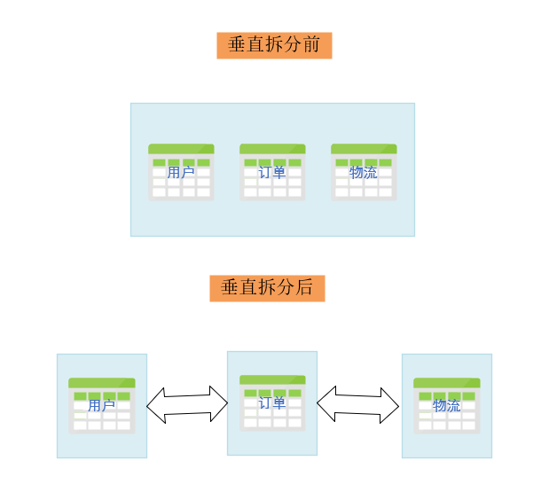
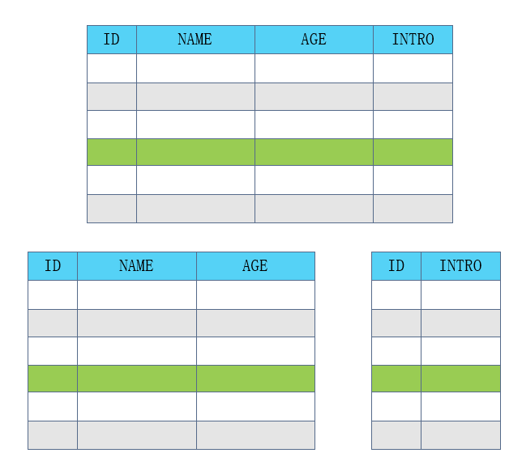

---

title: 数据库的分库分表操作

tags: 
	[数据库,分库,分表]

---

## 1、前言
 很早就听说了分库分表操作，但是一直没记住，这里只是单纯做个笔记。
 
## 2、读写分离

将数据库分为主从库，一个主库（Master）用于写数据，多个从库（Slaver）进行轮询读取数据的过程，主从库之间通过某种通讯机制进行数据的同步，是一种常见的数据库架构。读写分离有个问题就是同步问题，有时候我们想要及时返回数据呢？所以我们经常是把一些着急返回的通过代码形式从主库去获取。

### 2.1、 为什么要读写分离
大多数互联网数据操作往往都是读多写少，随着数据的增长，数据库的“读”会首先成为瓶颈。如果我们希望能线性地提升数据库的读性能和写性能，就需要让读写尽可能的不相互影响，各自为政。在使用读写分离之前我们应该考虑使用缓存能不能解决问题。然后再考虑对数据库按照 “读” 和 “写” 进行分组。读写分离意味着将一体的结构的进行分散，在数据量大、高并发的情景中要考虑以下这些问题

<!--more-->

1. 如何保证 Master 的高可用，故障转移，熔断限流等。
2. 读写操作的区分规则，代码层面如何处理好读命令和写命令，尽量无感知无业务入侵。
3. 数据一致性的容忍度。虽然是数据同步，但是由于网络的不确定性这仍然是一个不可忽视的问题。

## 3、分库
数据库垂直拆分、数据库水平拆分 统称 分库。是指按照特定的条条件和维度，将同一个数据库中的数据拆分到多个数据库（主机）上面以达到分散单库（主机）负载的效果。这样我们变相地降低了数据集的大小，以空间换时间来提升性能。

### 3.1、 数据库垂直拆分
数据库垂直拆分 指的是按照业务对数据库中的表进行分组，同组的放到一个新的数据库（逻辑上，并非实例）中。需要从实际业务出发将大业务分割成小业务。比如商城的整个业务中的 用户相关表，订单相关表，物流相关表 各自独立分类形成 用户系统数据库，订单系统数据库，物流系统数据库。

这样带来了一些好处： （a）业务清晰，职责单一 （b）易维护，易扩展 （c）数据服务化 。 同时也有一些负面的作用：（a）提高了整个应用的复杂度，而且会形成跨库事务 （b）引发 “木桶效应”，任何一个短板有可能影响整个系统 （c）部分表关系不能 join 只能通过服务相互调用来维系。甚至由于网络问题引发数据不一致。

在需要进行分库的情况下，通常可优先考虑垂直拆分。

### 3.2、 数据库水平拆分

在数据库垂直拆分后遇到单机数据库性能瓶颈之后，就可以考虑数据库水平拆分了。 之所以先垂直拆分才水平拆分，是因为垂直拆分后数据业务清晰而且单一，更加方便指定水平的标准。比如我们对商城业务垂直拆分后的 用户系统 进行水平拆分就比对整个商城业务进行水平拆分好找维度，我们可以根据用户注册时间的区间、用户的区域或者用户 ID 的范围、 hash 等条件，然后关联相关表的记录将数据进行拆分，如果放在整个商城业务上你是以用户为准还是以订单为准都不太好考虑。

我们按照每100万为区间对用户系统水平拆分如下：

这种拆分的好处在于： （a）单个库的容量可控 （b）单挑记录保证了数据完整性 （c）数据关系可以通过 join 维持 （d） 避免了跨库事务 ；缺点同样存在：（a）拆分规则对编码有一定的影响 （b）不同业务的分区交互需要统筹设计

## 4、 分表
分表也分为 数据表垂直拆分 和 数据表水平拆分 。
### 4.1、 数据表垂直拆分
数据表垂直拆分就是纵向地把表中的列分成多个表，把表从“宽”变“窄”。一般遵循以下几个点进行拆分：

冷热分离，把常用的列放在一个表，不常用的放在一个表。
大字段列独立存放
关联关系的列紧密的放在一起
我们把用户表中常用的和不常用的而且大字段分离成两张表：

### 4.2、 数据表的水平拆分
表的水平拆分感觉跟库的水平拆分思想上都是一样的，只不过粒度不同。表结构维持不变。也就是说拆分后数据集的并集等于拆分前的数据集。理解了 3.2 章节 之后这个就没有什么可说的了。

## 5、 总结
这里简单阐述了几个数据库优化概念，在实际操作中往往会组合使用。我们在实际操作之前要做好数据量的预估，这样能够根据预测未来数据的增量来进行选型。业务数据增长较小，常用于表的拆分。增长特别大达到上万级别则可以选择分库，比如一些资金积分流水，历史记录之类的。有些时候并不是拆分完就万事大吉了，比如我们按照地区拆分后，A地区业务增长很快业绩很好，而B地区推广不力竞争激烈业绩萧条，造成了数据倾斜。也会影响分库分表的期望效果。这需要建立长效的监控预测机制来应对，甚至根据实际情况及时调整策略。数据拆分还面临分布式的很多问题，分布式事务，高可用，数据一致性，全局唯一性都是应该考虑的问题。
